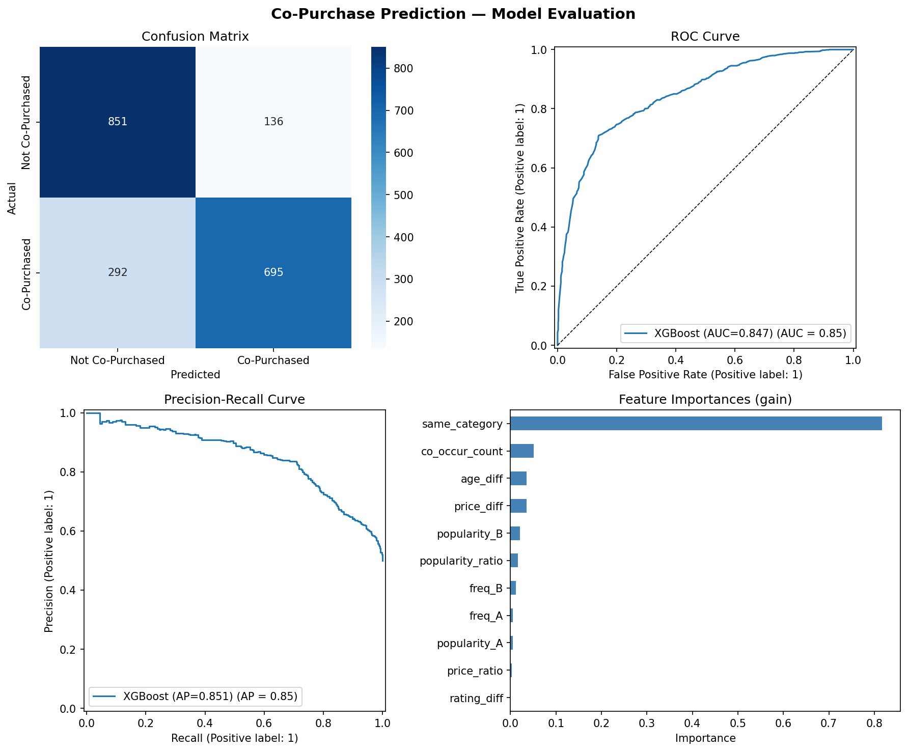

# From Baskets to Predictions
### A Market Basket Analysis & Co-Purchase Recommendation Engine

> **Given a product a customer is viewing, which other products are they most likely to buy together?**

This project builds an end-to-end machine learning pipeline that answers that question — from raw shopping cart data through feature engineering to a trained XGBoost classifier that generates ranked product recommendations.

---

## Results

| Metric | Score |
|--------|-------|
| ROC-AUC (test) | **0.847** |
| PR-AUC (test) | **0.851** |
| F1 Score | **0.765** |
| CV ROC-AUC (5-fold) | 0.825 ± 0.008 |



---

## Project Structure

```
From-Baskets-to-Predictions/
├── data_raw/
│   ├── carts.json          # 507 shopping carts (7 real + 500 synthetic)
│   └── products.json       # 20 products with metadata
│
├── models/
│   ├── co_purchase_model.json   # Trained XGBoost model
│   ├── evaluation_plots.png     # Confusion matrix, ROC, PR, feature importance
│   └── cv_scores.png            # Cross-validation score distribution
│
├── fetch-raw.py        # [Step 1] Fetch products & carts from FakeStore API
├── augment_data.py     # [Step 2] Generate 500 synthetic carts for richer training data
├── make-pairs.py       # [Step 3] Extract positive/negative co-purchase pairs
├── build_features.py   # [Step 4] Engineer 11 features per product pair
├── train_model.py      # [Step 5] Train, tune, evaluate, and save the model
├── predict.py          # [Inference] Generate recommendations for any product
│
├── pairs.csv           # 9,868 labeled product pairs
├── X.parquet           # Feature matrix (9,868 × 11)
├── y.csv               # Binary labels
└── requirements.txt
```

---

## How It Works

### 1. Data Collection (`fetch-raw.py`)
Fetches real e-commerce data from the [FakeStore API](https://fakestoreapi.com) — 20 products across 4 categories (electronics, jewelry, men's clothing, women's clothing) and 7 shopping carts.

### 2. Data Augmentation (`augment_data.py`)
The API only returns 7 carts — far too few for reliable ML. This script generates **500 synthetic carts** using a weighted-sampling strategy that mirrors real purchase behavior:
- **70% category-focused carts** — items from the same category are more likely to appear together (mimicking how shoppers browse)
- **30% mixed carts** — random cross-category purchases
- Sampling is weighted by product popularity (rating count)

### 3. Pair Generation (`make-pairs.py`)
Extracts labeled training examples from the cart log:
- **Positive pairs (label=1)**: Products that appear together in the same cart
- **Negative pairs (label=0)**: Products that never share a cart
- Dataset is balanced: 4,934 positives + 4,934 negatives = **9,868 pairs total**

### 4. Feature Engineering (`build_features.py`)
Builds 11 features per (Product A, Product B) pair:

| Feature | Description |
|---------|-------------|
| `price_diff` | Absolute price difference |
| `price_ratio` | min/max price (1.0 = same price) |
| `same_category` | 1 if both products share a category |
| `rating_diff` | Absolute difference in average ratings |
| `popularity_A` | Rating count of product A |
| `popularity_B` | Rating count of product B |
| `popularity_ratio` | min/max popularity ratio |
| `age_diff` | Days between product release dates |
| `co_occur_count` | Number of carts containing *both* products |
| `freq_A` | How many carts include product A |
| `freq_B` | How many carts include product B |

`co_occur_count` is the strongest signal — it directly encodes historical co-purchase evidence.

### 5. Model Training (`train_model.py`)
- **Algorithm**: XGBoost gradient-boosted classifier
- **Validation**: Stratified 5-fold cross-validation
- **Tuning**: `RandomizedSearchCV` over 50 hyperparameter combinations (n_estimators, max_depth, learning_rate, subsample, colsample_bytree, gamma, min_child_weight)
- **Outputs**: Evaluation plots + serialized model saved to `models/`

---

## Quickstart

### Prerequisites
```bash
pip install -r requirements.txt
```

### Run the full pipeline
```bash
# 1. Fetch raw data from the API
python fetch-raw.py

# 2. Augment with synthetic carts
python augment_data.py

# 3. Generate labeled pairs
python make-pairs.py

# 4. Engineer features
python build_features.py

# 5. Train and evaluate the model
python train_model.py
```

### Generate recommendations
```bash
# List all available products
python predict.py --list_products

# Get top-5 recommendations for product #9 (WD External Hard Drive)
python predict.py --product_id 9 --top_n 5
```

**Example output:**
```
Anchor product [9]: WD 2TB Elements Portable External Hard Drive - USB 3.0
Category: electronics | Price: $64.00

Top-5 co-purchase recommendations:
   product_id  title                                        category     price  co_purchase_prob
1          11  Silicon Power 256GB SSD 3D NAND A55 SLC...  electronics  109.00          0.821
2          10  SanDisk SSD PLUS 1TB Internal SSD...        electronics  109.00          0.821
3          12  WD 4TB Gaming Drive Works with PS4...       electronics  114.00          0.821
4          13  Acer SB220Q bi 21.5 inches Full HD...       electronics  599.00          0.733
5          14  Samsung 49-Inch CHG90 144Hz Curved...       electronics  999.99          0.629
```

---

## Design Decisions

**Why XGBoost?** Gradient boosted trees handle mixed feature types (continuous + binary) without scaling, are interpretable via feature importance, and consistently outperform simpler models on tabular data.

**Why synthetic data?** The FakeStore API is intentionally minimal (7 carts). Rather than train on 36 samples (which would make any results meaningless), synthetic carts with realistic category-affinity patterns give the model enough signal to learn from.

**Why co-occurrence as a feature rather than the label?** The label (`bought_together`) comes from cart co-occurrence — but `co_occur_count` as a *count* captures the strength of that relationship, making it a valid and highly informative feature for generalization to unseen pairs.

---

## Tech Stack

- **Python 3.10+**
- **XGBoost** — gradient boosted classifier
- **scikit-learn** — cross-validation, hyperparameter search, metrics
- **pandas / NumPy** — data manipulation and feature engineering
- **matplotlib / seaborn** — evaluation visualizations
- **requests** — API data fetching
